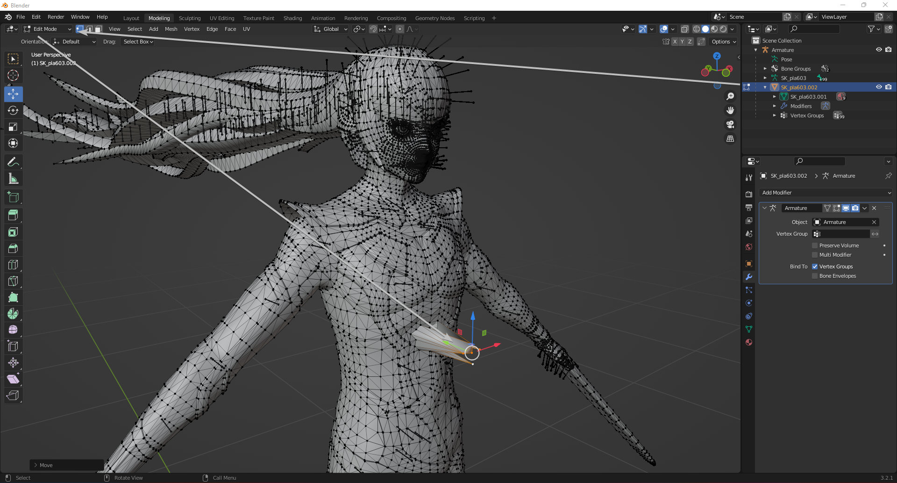
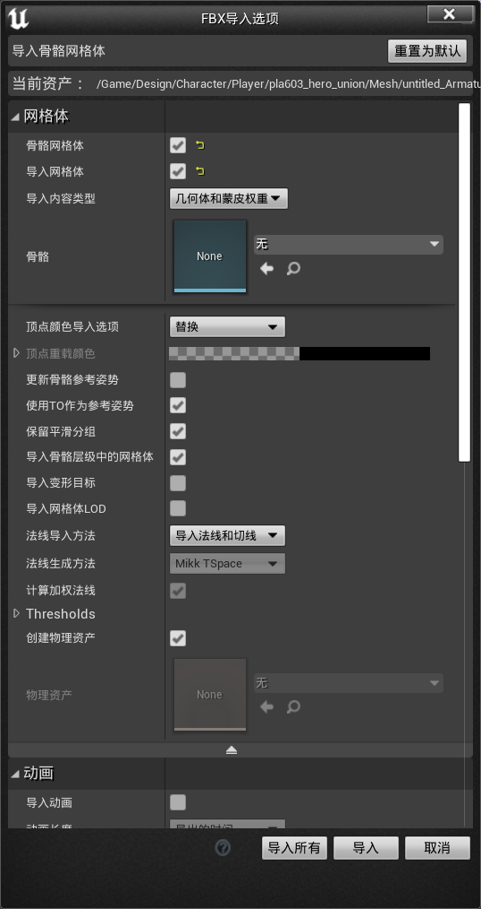
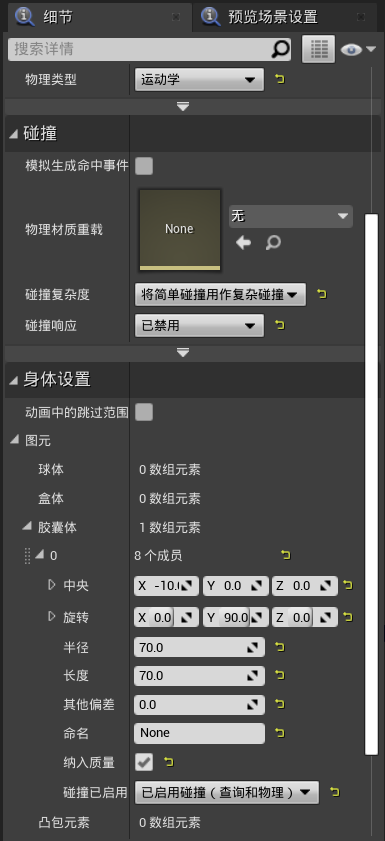

## 步骤 0：你需要的程序

- 虚幻引擎 4.27，你可以在 [虚幻引擎下载启动器](https://store.epicgames.com/en-US/download) 获取。
    - 提示：你可以安装到任何文件夹，为 UE4Editor.exe 创建快捷方式，然后稍后删除启动器。
- [Blender](https://www.blender.org/download/)，我使用的是 [3.6 版本](https://download.blender.org/release/Blender3.6/blender-3.6.9-windows-x64.msi)。**PSK 插件在 4.0+ 版本上无法工作。**
- [UModel](https://www.gildor.org/en/projects/umodel#files)。
    - 如果是 Switch 平台：[这个可执行文件可以提取 SMTVV 的 UI 纹理，本指南不会讲到，但请记住。](https://github.com/mugenrei/mods/blob/main/tools/umodel_smt5.exe)。
    - 如果是 Switch 平台：如果你想使用它，把它放在你解压 UModel 的文件夹中与默认 exe 放在一起。
- 或者使用 [FModel](https://github.com/4sval/FModel)。
- 如果是 Switch 平台：需要一个配置好密钥的模拟器，无论是 Ryujinx 还是 Yuzu，来提取游戏文件。

---

## 步骤 1：定位游戏文件

### PC

- Steam 版：
1. 在你的 `Steam 库 > 管理 > 浏览本地文件` 中右键点击游戏。
2. 游戏文件夹 SMT5V 会打开，保持打开状态，跳到步骤 2。

### 模拟器

- Ryujinx：
1. 添加包含 SMTV .NSP 的游戏文件夹。
2. 右键点击游戏 > 提取数据 > RomFS。
3. 选择文件夹，点击确定并等待。

- Yuzu：
1. 添加包含 SMTV .NSP 的游戏文件夹。
2. `右键点击游戏 > 导出 RomFS`。
3. **选择程序**，点击确定。
4. **完整**，点击确定。
5. 应该会将游戏提取到 `%APPDATA%/Yuzu/dump/010063B012DC6000/romfs`。

---

## 步骤 2：导出角色

### 从 UModel

1. **解压 UModel**。
2. （PC）下载 [oo2core_5_win32.dll](https://www.dllme.com/dll/files/oo2core_5_win32)
3. （PC）将 `oo2core_5_win32.dll` 复制粘贴到 **UModel 可执行文件**旁边。
4. 打开 UModel。
5. 在 `游戏文件路径` 中，点击 `...` 并浏览：
    - （PC）`Path/to/SteamLibrary/common/SMT5V`。
    - （NX）`Path/to/SMTVV/ExtractedRomFS`。
6. 勾选 `Override game detection`。
7. 在 `第一个下拉框`：**选择 Unreal engine 4**，`第二个下拉框`：
    - **选择 Unreal Engine 4.27**。
8. （NX）`平台`：**选择 Nintendo Switch**。
9. **点击确定**。

- **或者**：
    1. 在 **UModel 文件夹** 空白处右键单击，然后 `新建 > 文本文档`。
    2. 将其命名为 `Start.bat`。
    3. 打开它并粘贴以下内容：
        - （PC）`"umodel.exe" "Path/to/SMT5V/Folder" -game="ue4.27"`
        - （NX）`"umodel.exe" "Path/to/SMTVV/Folder" -game="ue4.27" -nsw`
    4. **打开它**，这是一个很好的快捷方式！

10. 进入角色文件夹：
- 对于 **主角**，也就是 Nahobino 形态的主角，进入 `Game/Design/Character/Player/pla603_hero_union/Mesh`。
11. 单击 `SK_Pla603.uasset` 然后点击程序页脚的 `导出`。
12. 设置一个**输出文件夹**，然后在 `Skeletal Mesh` 下的 `Mesh Export` 中，**选择 ActorX (psk)** 然后点击确定。
13. 再次单击 `SK_Pla603.uasset` 然后点击程序页脚的 `导出`。
14. 设置一个**输出文件夹**，然后在 `Skeletal Mesh` 下的 `Mesh Export` 中，**选择 glTF 2.0** 然后点击确定。
15. **关闭 UModel**。

### 从 FModel

1. **解压 UModel**。
2. 打开 FModel。
3. 点击 `目录 > 选择器`。
4. 点击 **添加未检测到的游戏** 下方的箭头图标。
5. 在 **目录** 中，选择：
    - （PC）`Path/to/SteamLibrary/common/SMT5V`。
    - （NX）`Path/to/SMTVV/ExtractedRomFS`。
6. 点击 `+ 按钮`。
7. 在顶部区域将 **UE 版本** 更改为 `GAME_UE4_27`。
8. 点击确定。

9. （NX）在顶部栏点击 `设置`。
10. （NX）在 **纹理平台** 中选择 `Nintendo Switch`。

11. 进入角色文件夹：
    - 对于 **主角**，也就是 Nahobino 形态的主角，进入 `Game/Design/Character/Player/pla603_hero_union/Mesh`。
12. 右键点击 `pla603_hero_union` 文件夹，然后：
    - 保存文件夹的包纹理 (.png)。
    - 保存文件夹的包模型。
    - 保存文件夹的包动画。（可选，如果你想在 blender 中加载动画。）
13. （NX）在顶部栏点击 `设置`。
14. 在侧边栏 `Models` 将网格格式 `Mesh Format` 更改为 glTF 2.0 (binary)
15. 右键点击 `pla603_hero_union` 文件夹，然后：
    - 保存文件夹的包模型。
16. 输出将在 `FModel 文件夹/Output/Exports/Project`。
17. **关闭 FModel**。

---

## 步骤 3：安装 Blender 插件

1. 下载这个 [blender3d_import_psk_psa](https://github.com/matyalatte/blender3d_import_psk_psa) 分支。
2. **打开 Blender**，转到 `文件 > 偏好设置 > 插件`。
3. **在 Blender 中安装插件** 并勾选框启用它。
4. 你应该能在 Blender 视口的 `CTRL`+`N` 侧边栏中看到 PSK 插件。
5. **打开它**。

---

## 步骤 4：在 Blender 中导入并合并文件

1. **点击导入 PSK**。
2. 转到 `文件 > 导入 > GLTF`。
    - 如果 glTF 骨骼颠倒了，忽略它，继续按步骤操作。
3. 点击**骨架对象**（导入的 PSK）然后 CTRL 点击**GLTF 导入对象**。
4. 在 PSK 插件中点击 **合并 PSK 和 GLTF**。
    - 为什么要这样做？：PSK 通常不保留平滑组，导致网格无法保存，所以你使用带有 PSK 骨架的 glTF 网格。
5. 删除 glTF 骨架。

---

## 步骤 5：在 Blender 中编辑网格

1. 选择骨架内的网格并进入**编辑模式**。
2. **进行一些编辑**，你可以只需移动一些顶点。

3. 或者你可以进入 Blender 的雕刻模式选项卡试一试。
4. 进入**雕刻选项卡**[1]，然后展开你的**骨架对象**[2]，**选择网格**[3] 并进入**雕刻模式[4]**。

5. 之后你可以启用**对称镜像来帮助你**[1]，然后你可以更改你的**笔刷选项**[2] 或选择一个**不同的模式**[3]。

6. 然后**刷你的模型**！你可以用这个来**改进女性模型**，或者做**超大主角**！

---

## 步骤 6：从 Blender 导出

1. 进入**对象模式**并保存项目。
2. 选择**骨架对象**。
3. 确保它命名为 **Armature**。
4. 点击**导出为 FBX**。

---

## 步骤 7：导入到虚幻引擎 4.27

1. 打开**虚幻引擎 4.27** 并创建一个名为 Project 的空白项目，名称可选。
2. 创建角色的**"Mesh"文件夹**结构。
    - 对于 **主角** 就是 `/Content/Design/Character/Player/pla603_hero_union/Mesh`。
3. 将你从 Blender 导出的 FBX 重命名为与角色的 uasset 名称匹配（例如 `SK_pla603.fbx`）。
4. 将其拖放到 UE4 的 **"Mesh"文件夹** 中。

5. 本教程不需要**纹理**。
---

## 步骤 8：设置导入设置

1. 勾选这些导入设置：**Use T0 As Ref Pose**、**Import Normals and Tangents**。

---

## 步骤 9：准备烹饪

1. 将 `SK_pla603_PhysicsAsset` 重命名为 `SK_pla603_PhAT`
1. 创建**材质文件夹**：
    - 还是以 **主角** 为例，就是 `/Content/Design/Character/Player/pla603_hero_union/Material`。
2. 将 UE4 创建的材质移动到**材质文件夹**。

## 步骤 9.1：创建 PostAnimBP（仅适用于 Pla601 或 Pla603）

1. 在 **Mesh 文件夹** 中右键点击 `SK_pla603 > 创建 > 动画蓝图`。
2. 命名为 `Pla603_PostAnimBP`。
3. 创建**以下文件夹**：
    - `/Content/Blueprints/Character/Player/Pla603/`。
4. 将 `Pla603_PostAnimBP` 移动到 **Pla603 文件夹**。

5. 在 **Mesh 文件夹** 中双击 `SK_pla603`。
6. 在 `资源详情` 侧边栏中，向下滚动到**骨骼网格体**部分。
7. 在**后处理动画蓝图**下拉菜单中找到 `Pla603_PostAnimBP`。
8. 关闭 `SK_pla603` 窗口。

## 步骤 9.2：设置物理资源（修复相机卡入身体）
- 这是主角 Pla603 的数值，其他角色：[学习如何获取它们。](https://github.com/mugenrei/mugenrei.github.io/wiki/SMTVV-%E2%80%90-Making-the-character's-PhAT)
1. 在 **Mesh 文件夹** 将 `SK_pla603_PhysicsAsset` 重命名为 `SK_pla603_PhAT` 并双击打开它。
2. 在 `骨架树` 侧边栏中，选择任意骨骼，按 `CTRL + A` 全选然后取消选择 `b_pelvis` 骨骼。（ 用CTRL + A可能会无响应一阵子，用点击第二个然后SHIFT + END的方式更流畅 ）
3. 右键点击选中内容并选择 `删除`。
4. 选择 `b_pelvis` 骨骼，在右侧选项卡的详情中：
    - 在**碰撞**下将**碰撞响应**更改为 `Disabled`。
    - 在**物理**下将**物理类型**更改为 `Kinematic`。
    - 在**主体设置**下展开**基元**、**胶囊体**和 **0**：
        - 将中心的 X 设置为 `-10`
        - 将中心的 Y 设置为 `90`
        - 将**半径**设置为 `70`
        - 将**长度**设置为 `70`

5. 关闭 `SK_pla603_PhAT` 窗口。

3. 转到 `文件 > 为 Windows 烹饪内容`。

---

## 步骤 10：创建 Mod 文件夹

1. 创建 mod 的工作文件夹，在本例中是**示例文件夹**。
2. 在这个文件夹里面你：
    - 解压 `UnrealPak.exe` 和伴随它的 `BAT 文件`。
    - 为 pak 创建一个文件夹，在这个例子中是 **exahero 文件夹**。
3. 在 **exahero 文件夹** 内创建来自 UE4 的 mod 文件夹结构。
    - `exahero/Project/Content/Design/Character/Player/pla603_hero_union/Mesh`。
    - 不需要材质或 Blueprints 文件夹。
4. 将烹饪后的 Mesh 文件夹中的**网格**和**物理资源**文件移动到 mod 的 Mesh 文件夹，**纹理**也一样。
    - 应该在 `D:\Documents\Unreal Projects\ProjectName\Saved\Cooked\WindowsNoEditor\ProjectName\Content\Design\Character\Player\pla603_hero_union\Mesh`
    - 不要移动骨架 uasset，否则会破坏游戏。

---

## 步骤 11：打包并安装 Mod

1. 将 mod 的 **exahero 文件夹** 拖到 **unrealpak 的批处理文件** 上。

2. 将 `mod.pak` 复制到游戏的 **~mods 文件夹**。
    - 如果你没有安装 mod 的经验，请参考我的 Mod 安装指南。
3. **启动游戏**。

---

## 打开游戏
    - 你应该会注意到你所做的修改！

---

祝你改装愉快！
