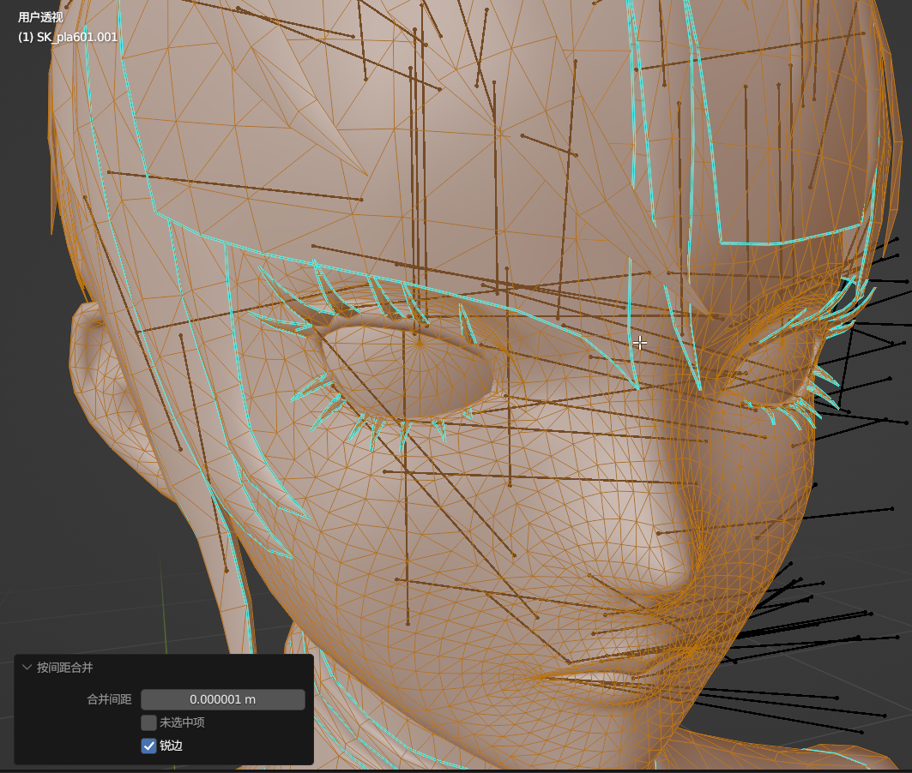
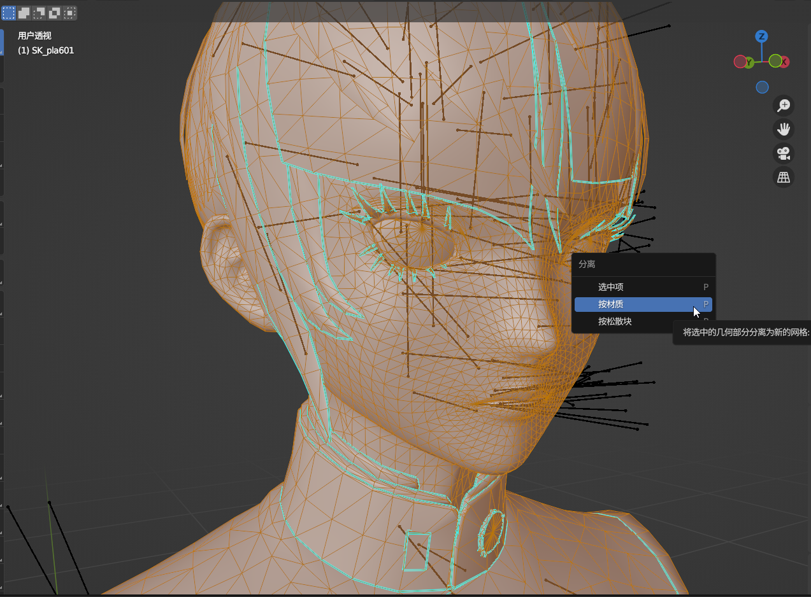
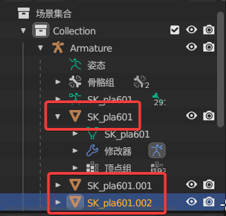
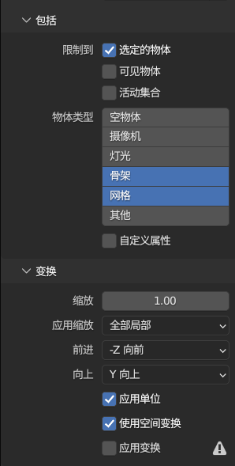
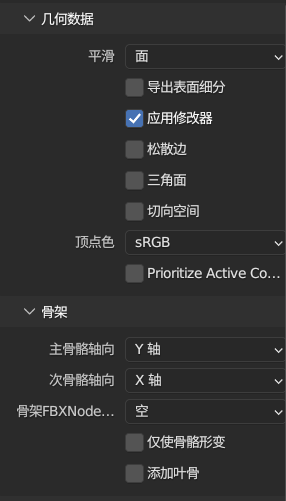
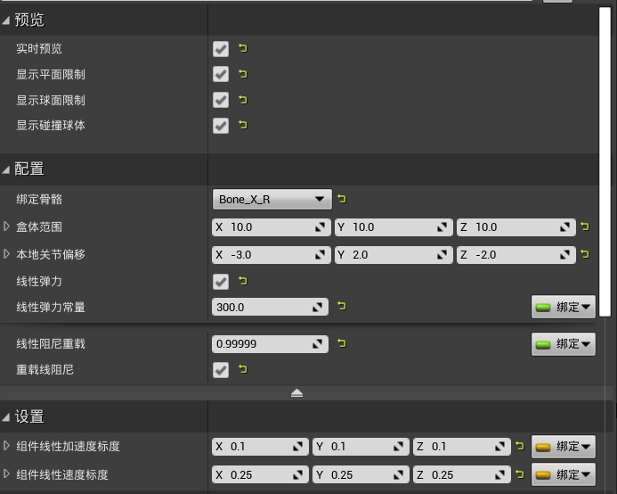
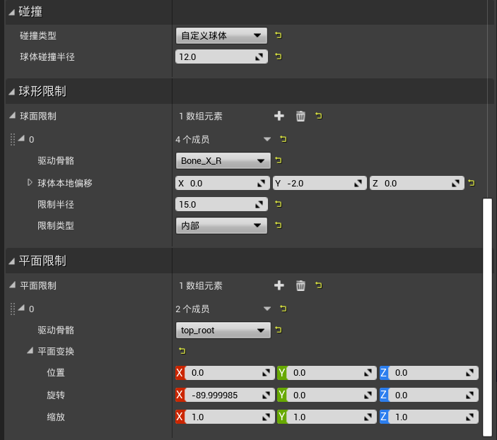
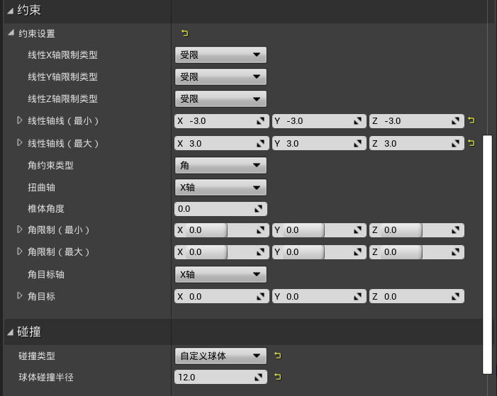

## 模型编辑建议

- 因为模型是游戏逆向出来的所以网格都是分散的，可以合并顶点后再进行雕刻操作（锐边选项是必要的，否则会破坏网格的法相）

---

- 然后可以按材质分离网格，可以方便 UV 和贴图的编辑

---

## 逆向学习建议

- 可以用 FModel 逆向 mod 进行学习

---

- 逆向 mod 的时候建议最后导出贴图确保贴图不被覆盖

---

## 动画

需要导出动画时的设置（可以添加一个操作项预设）

---

## 物理

胸部物理的话可以参考我下图中的数值，盒体范围和本地关节偏移根据模型的实际大小做修改

